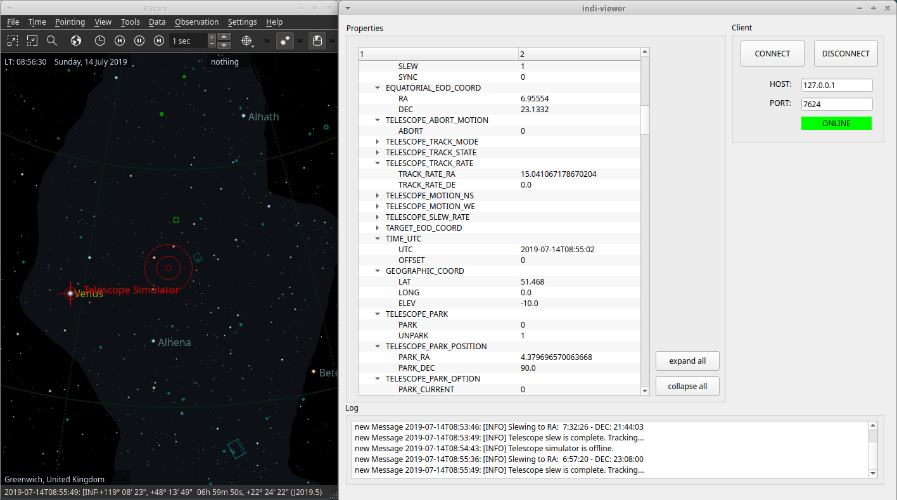

# indi-viewer

INDI stands for Instrument Neutral Distributed Interface.
This repository is a simple GUI tool for visualising properties of devices running remotely or locally
on an indiserver. Very useful as a single point tool to visualize all
available properties and realtime values of multiple devices running on INDI.

## Prerequisites

* [PyQt5](https://pypi.org/project/PyQt5/)
* [pyindi-client](https://pypi.org/project/pyindi-client/)

## Features

The program uses the PyIndi.BaseClient standard implementation [here](https://indilib.org/support/tutorials/166-installing-and-using-the-python-pyndi-client-on-raspberry-pi.html)
and catches new devices, properties and property values that become available.

When a new property is received, it is linked to it's corresponding device and
put in the right place in the main treeview widget. Messages that are passed via
the PyIndi.BaseClient are caught and displayed in a QTextBrowser widget. When
properties of devices are no longer available they are removed from the treeview.

A screenshot of the GUI is illustrated below:



You can edit indi-viewer.ui with QtDesigner and edit it to your liking.

## Usage

Simply run Kstars and start Ekos with your devices or simulator instances.
Then run the GUI tool and configure the ip address and port (default 127.0.0.1:7624 for a local indiserver)
```
python3 indi-viewer.py
```


Or you can also run indiserver directly and observe the instrument properties:
```
indiserver -v indi_simulator_telescope ccd_simulator
```

Then start indi-viewer on another machine connected to the network:
```
python3 indi-viewer.py
```

## Sources

Definetely checkout [indilib](https://www.indilib.org) and [KStars](https://edu.kde.org/kstars/).
